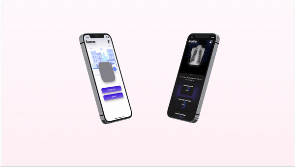

# CoviScan

## Covid-19/Pneumonia Detection Application through Chest Radiographs

Currently, Covid-19 can be diagnosed via RT-PCR to detect genetic material from the virus or chest radiographs. However, it can take a few hours and sometimes days before the molecular test results are back. By contrast, chest radiographs can be obtained in minutes. 

Through this application we will be helping in differentiating those patients which need more attention(severe cases) than others and reducing pressure on doctors to check every patients. With this application, doctors can identify critical patients instantly without wasting any minute. 

This application not only helps doctors but helps patients too. With one tap, patients can get to know what they are suffering from. Patients only need their X-ray images and rest of the work is done by the app. Patients can self assess themselves and can act accordingly without wasting any second. 

In this project, we have developed an iOS app. It is beautifully designed app with great UI which makes it very user friendly. Mostly the app is built on SwiftUI framework. Some parts of the app is built on Swift and UIKit especially the ImagePicker code and code related to displaying Lottie Animation. The app contains Login Page which is powered by Firebase. Features like Dark Mode and Persistent Login are also available. The app works on any iPhone and iPad which supports iOS 14 or above. 

Apart from this, the Computer Vision Classifier is also developed for this project is based on Convolution Neural Network(CNN) in Deep Learning it scans the images and publishes the result which is displayed on the user screen. User images are send to the model using APIs. 

## Screenshots:

  
  
  
  

## Video Link for iOS Demo:
1) https://youtu.be/BOTp2OKDSng
2) For Computer Vision Classifer Video: https://drive.google.com/drive/folders/1GNJ2s8IITd-mcoisUrhDMtzAILqMUSLq?usp=sharing

## Link for Computer Vision Classifier:
https://github.com/ayush9304/Covid19-Detector

## Installation:
- Download Xcode from AppStore on Mac. 
- Clone this repository(or download zip). 
- Open the CoviScan.xcodeproj file using Xcode
- Set the Active Scheme to "CoviScan" and Simulator device to "iPhone 13"
- Run the project.
